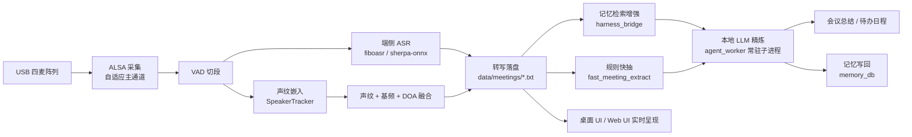

# ⚡ SC171 实时会议助手（MeetingAgent）
> 赛事：全国大学生嵌入式芯片与系统设计竞赛 · 广和通 AIoT 赛题
> 奖项：（待补充）
> 年份：2026
> 平台：广和通 SC171（Qualcomm QCS6490）
> 团队：（团队名称待补充）·（学校待补充）

## 📖 作品简介

面向边缘智能终端的**本地化会议智能系统**。以 USB 四麦克风阵列采集会场语音，在设备端（SC171 / QCS6490）完成实时语音识别（ASR）、说话人分离与声纹认人，并由规则引擎 + 本地大模型自动生成会议总结与待办日程——**全程数据不出板端**，从拾音、认人到理解、呈现整条链路都在一块开发板上闭环。系统针对会议场景中语音数据敏感、云端方案存在隐私与断网风险、通用转写工具"只转不整理"等痛点，把能力做成一体：会中实时出字并标注说话人真名，会后秒级拿到结构化纪要与待办，还能跨场次积累记忆、越用越准。

## 🧠 核心功能

- **实时语音转写**：ALSA 多通道采集 + 自适应主通道，端侧 ASR（fiboasr QNN DSP / sherpa-onnx）实时出字
- **说话人分离与认人**：声纹预注册（支持中文姓名）+ 在线分离（声纹质心 + 基频/共振峰 + GCC-PHAT DOA 融合），会中优先显示真名，未命中回退「说话人 N」
- **智能纪要与日程**：规则引擎毫秒级抽取任务/决策草稿，本地 Qwen3-0.6B（QNN DSP）按需精炼，兼顾响应速度与纪要质量
- **跨场次记忆闭环**：会前检索历史记忆注入 LLM 输入修正人名与专有名词，会后异步写回，越用越准
- **双形态交互**：Tkinter 桌面 Kiosk UI（板端 DSI/HDMI 实体屏全屏）+ Flask/SSE Web UI（浏览器访问）

## 🏗️ 系统架构



数据分层：**纯语音链路**（`speech/`，可独立运行）→ **理解层**（`UI/*.py` + `ai_runtime/`，纪要生成与长期记忆闭环）→ **交互层**（`UI/desktop/`、`UI/web/`）。

## 📂 目录结构

```text
├── README.md               # 本文件
├── docs/                   # 工程文档（完整版原工程 README：配置详解/模块说明/FAQ）
│   └── 工程README.md
├── hardware/               # 硬件清单与环境要求（板卡/麦阵/显示/License）
├── firmware/               # （不适用：板端为 Linux 用户态应用，无独立 MCU 固件）
├── edge_computing/         # ⭐ 作品主体（整棵工程树，内部相对路径自洽）
│   ├── speech/             #   纯语音链路：采集/VAD/ASR/说话人/声纹注册/DOA
│   │   ├── src/  doa/  scripts/  models/
│   │   └── requirements.txt
│   ├── ai_runtime/         #   LLM 纪要抽取 / 长期记忆库 / 向量后端
│   ├── UI/                 #   交互层 + 理解层桥接（desktop/ web/ agent_bridge 等）
│   ├── ai_models/          #   端侧模型仓库（权重不入库，见其中 README 获取方式）
│   └── data/               #   运行数据（会议场次/纪要/记忆）
├── cloud/                  # （不适用：卖点即数据不出板端，无云端依赖）
└── tools/                  # 辅助工具索引（环境安装/模型下载/评估脚本位于 speech/scripts/）
```

> 模型权重（约 3.1 GB）不入 Git 仓库，获取与放置方式见 [edge_computing/ai_models/README.md](edge_computing/ai_models/README.md) 与下方模型清单。

## 🚀 快速开始

```bash
git clone https://github.com/Fiborn/fibocom-embedded-2026-MeetingAgent.git
cd fibocom-embedded-2026-MeetingAgent

# 0. 工程放置（板端）
#    cp -r edge_computing /home/fibo/MeetingAgent
#    /home/fibo/qcom_6490_license/          ← License 四个文件（key1-3.pem + license.bin）

# 1. 语音链路依赖（系统 Python 3.8.10，不创建虚拟环境）
cd /home/fibo/MeetingAgent/speech
bash scripts/install_env.sh          # apt + pip 依赖（清华源）
python3 scripts/download_model.py    # 下载 sherpa-onnx ASR/声纹/VAD 模型

# 2. 语音链路自检
python3 src/list_devices.py          # 列出声卡
python3 src/check_env.py             # 环境与模型自检
python3 src/meeting_realtime.py      # 独立实时转写（Ctrl+C 结束）

# 3. 启动完整 UI（二选一，必须在板端本机终端执行）
cd /home/fibo/MeetingAgent/UI
bash desktop/run.sh                  # 桌面 UI：板端 DSI 实体屏全屏
bash web/run.sh                      # Web UI：http://<板卡IP>:8787
```

## 📦 模型清单

| 路径（相对 edge_computing/） | 体积 | 用途 | 获取方式 |
|------|------|------|------|
| `ai_models/asr_models/fiboasr/` | 227 MB | 实时 ASR（QNN/SNPE DSP） | 广和通 SC171 SDK / fiboaisdk |
| `ai_models/llm_models/Qwen3-0.6B/` | 897 MB | 会议纪要/日程精炼（主力） | 广和通 SC171 SDK（QNN DSP） |
| `ai_models/llm_models/deepseek-r1-distill-qwen-1.5b/` | 1.4 GB | 备选大模型（MNN CPU） | 广和通 SC171 SDK（MNN） |
| `ai_models/tts_models/` | 124 MB | 语音播报 | 广和通 SC171 SDK（QNN DSP） |
| `ai_models/embedding_models/bge-small-zh-v1.5/` | 180 MB | 记忆检索向量后端 | HuggingFace `BAAI/bge-small-zh-v1.5`（转换 DLC/ONNX） |
| `speech/models/asr/model.onnx` | 232 MB | sherpa-onnx ASR（独立语音链路） | `python3 speech/scripts/download_model.py` 自动下载 |
| `speech/models/embedding.onnx` | 38 MB | 声纹嵌入 | 同上，自动下载 |
| `speech/models/silero_vad.onnx` | 0.6 MB | VAD | 同上，自动下载 |

## 🔧 配置说明（`edge_computing/UI/ui_config.json`）

`llm_model`（qwen/deepseek 切换）、`timezone`（默认 Asia/Shanghai）、`license_dir`、`mic`（采集后端/ALSA 设备/通道）、`speaker`（聚类阈值/DOA 权重）、`asr`（VAD 阈值/增益）、`llm_worker`（常驻进程预热与超时）、`meeting_extract`（rules_llm 模式）、`harness`（记忆检索与写回开关）。逐项说明见 [docs/工程README.md](docs/工程README.md)。

## ❓ 常见问题

| 现象 | 原因与处理 |
|------|-----------|
| 声卡可见但 `/dev/snd/pcmC*D0c` 不存在 | 在沙箱/容器里运行，音频设备被隔离，请在板端本机终端执行 |
| 会议时间戳比本地时间少 8 小时 | 确认 `ui_config.json` 的 `timezone` 为 `Asia/Shanghai` |
| 纪要走规则、未调用大模型 | 检查 `llm_worker`/`meeting_extract` 配置与模型文件是否就位 |
| License 初始化失败 | 确认 `/home/fibo/qcom_6490_license/` 四个文件齐全 |

## ✨ 技术亮点

1. **端侧全链路闭环** —— 拾音到纪要全部在板端完成，无需上传云端音频
2. **声纹预注册 + 在线分离双轨认人** —— 会前注册真名，会中优先匹配；未命中回退「说话人 N」
3. **多麦阵列感知增强** —— 自适应主通道 + 最佳通道选择，结合 DOA 与基频/共振峰特征抑制串人
4. **规则引擎与本地大模型协同** —— 规则毫秒级出草稿，大模型按需精炼
5. **会后 Harness 记忆闭环** —— 跨场次记忆注入与写回，越用越准
6. **一体交付** —— 桌面实体屏 Kiosk UI 与 Web UI 双形态，启动脚本自动配置麦增益与显示环境
