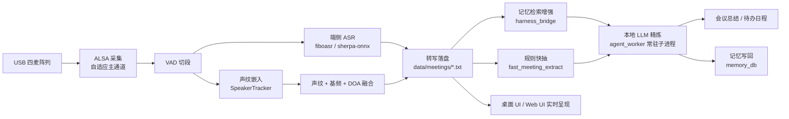

# SC171 实时会议助手

面向边缘智能终端的**本地化会议智能系统**。以 USB 多麦克风阵列采集会场语音，在设备端（SC171 / QCS6490）完成实时语音识别（ASR）、说话人分离与声纹认人，并由规则引擎 + 本地大模型自动生成会议总结与待办日程——**全程数据不出板端**。

| 环节 | 技术选型 |
|------|----------|
| 采集 | ALSA + Timesintelli / DOV USB 四麦阵列，自动探测声卡与通道数 |
| 识别 | 端侧 ASR（fiboasr QNN） + sherpa-onnx 声纹嵌入 + GCC-PHAT DOA |
| 理解 | 规则引擎秒级出草稿 → 本地 Qwen3-0.6B / DeepSeek-R1-1.5B 精炼 |
| 交互 | Tkinter 桌面 UI（板端 DSI/HDMI 实体屏全屏） 或 Flask Web UI（浏览器 Kiosk） |

---

## 一、系统架构



数据分层：

- **纯语音链路**（`speech/`）：采集 → VAD → ASR → 说话人 → 转写，可脱离 UI 独立运行。
- **理解层**（`UI/agent_bridge.py` + `harness_bridge.py` + `ai_runtime/`）：纪要生成与长期记忆闭环。
- **交互层**（`UI/desktop/`、`UI/web/`）：实时转写呈现、会中控制、历史回顾。

---

## 二、目录结构

```
MeetingAgent/
├── README.md                     本文件（工程总览）
├── ai_models/                    端侧模型仓库（约 2.9 GB，随工程拷贝）
│   ├── asr_models/fiboasr/       ASR 模型（QNN/SNPE DSP）
│   ├── llm_models/
│   │   ├── Qwen3-0.6B/           纪要精炼主力模型（QNN DSP）
│   │   └── deepseek-r1-distill-qwen-1.5b/   备选大模型（MNN CPU）
│   ├── tts_models/               TTS 播报模型
│   └── embedding_models/         bge-small-zh-v1.5 记忆检索向量后端
├── ai_runtime/                   运行时组件（LLM 纪要抽取 / 记忆库 / 向量后端）
├── data/                        运行数据（会议场次 / agent 纪要 / 长期记忆）
├── speech/                       纯语音链路（可独立运行）
│   ├── src/                      采集 / VAD / ASR / 说话人 / 声纹注册
│   ├── doa/                      GCC-PHAT 声源方位与广播
│   ├── models/                   sherpa-onnx ASR + 声纹 + VAD 模型
│   ├── scripts/                  环境安装 / 模型下载 / 评估工具
│   └── data/enrolled/            声纹注册档案（`<姓名>.json`）
└── UI/                           交互层
    ├── desktop/                  Tkinter 桌面 UI（板端实体屏，当前主 UI）
    ├── web/                      Flask + SSE Web UI（浏览器）
    ├── agent_bridge.py           本地 LLM 纪要 / 日程（常驻子进程调度）
    ├── harness_bridge.py         长期记忆检索增强与写回
    ├── fast_meeting_extract.py   规则引擎：秒级抽取任务与决策草稿
    ├── meeting_ai.py             麦克风 + 说话人 + ASR 会话
    ├── paths.py                  路径与运行时配置（含时区）
    ├── scroll_text.py            转写文本提取
    └── ui_config.json            运行时配置
```

---

## 三、硬件与环境

| 项目 | 要求 |
|------|------|
| 板卡 | SC171 / QCS6490（Qualcomm 平台） |
| Python | **系统 Python 3.8.10，不创建虚拟环境** |
| 侧 SDK | `fiboaisdk`，位于 `/usr/local/lib/python3.8/dist-packages/fiboaisdk` |
| License | `/home/fibo/qcom_6490_license/`（`key1.pem`、`key2.pem`、`key3.pem`、`license.bin`） |
| 麦克风 | USB 四麦阵列（Timesintelli / DOV），或普通 USB 声卡 |
| 显示 | DSI/HDMI 实体屏（桌面 UI）；或任意浏览器（Web UI） |
| 部署路径 | `/home/fibo/MeetingAgent` |

---

## 四、模型清单

| 路径 | 体积 | 用途 |
|------|------|------|
| `ai_models/asr_models/fiboasr/` | 227 MB | 实时 ASR（QNN/SNPE DSP） |
| `ai_models/llm_models/Qwen3-0.6B/` | 897 MB | 会议纪要 / 日程精炼（主力） |
| `ai_models/llm_models/deepseek-r1-distill-qwen-1.5b/` | 1.4 GB | 备选大模型（MNN CPU） |
| `ai_models/tts_models/` | 124 MB | 语音播报 |
| `ai_models/embedding_models/bge-small-zh-v1.5/` | 180 MB | 记忆检索向量后端（`memory_cli.py` 的 bge 索引） |
| `speech/models/asr/model.onnx` | 232 MB | sherpa-onnx ASR（独立语音链路） |
| `speech/models/embedding.onnx` | 38 MB | 声纹嵌入 |
| `speech/models/silero_vad.onnx` | 0.6 MB | VAD |

模型文件随工程整体拷贝，部署时保持上表目录结构即可，代码内路径均为相对/固定路径引用。

---

## 五、板端部署步骤

```bash
# 0. 工程放置
#    /home/fibo/MeetingAgent
#    /home/fibo/qcom_6490_license/          ← License 四个文件

# 1. 语音链路依赖（系统 Python，无 venv）
cd /home/fibo/MeetingAgent/speech
bash scripts/install_env.sh          # apt 依赖 + pip 依赖（清华源）
python3 scripts/download_model.py    # 若 models/ 下模型缺失

# 2. 语音链路自检
python3 src/list_devices.py          # 列出声卡
python3 src/check_env.py             # 环境与模型自检
python3 src/meeting_realtime.py      # 直接跑实时转写（Ctrl+C 结束）

# 3. 启动完整 UI（二选一）
cd /home/fibo/MeetingAgent/UI
bash desktop/run.sh                  # 桌面 UI：板端 DSI 实体屏全屏
bash web/run.sh                      # Web UI：http://<板卡IP>:8787
```

> `desktop/run.sh` 与 `web/run.sh` 都会先检查声卡是否注册、`/dev/snd` 是否可访问，
> **必须在板端本机终端执行**（沙箱/容器会隔离音频设备）。

---

## 六、配置说明（`UI/ui_config.json`）

| 配置段 | 说明 |
|--------|------|
| `llm_model` | 纪要精炼使用的模型：`qwen`（默认）/ `deepseek` |
| `timezone` | 进程时区，默认 `Asia/Shanghai`（板端系统为 UTC，由 `paths.apply_timezone()` 生效） |
| `license_dir` | License 目录，相对工程根（板端为 `../qcom_6490_license`） |
| `speaker_id_dir` | 语音链路目录，相对工程根 |
| `mic` | 采集后端、ALSA 设备、通道数、主通道、自动探测等 |
| `speaker` | 说话人聚类阈值、DOA 权重、声纹注册匹配阈值 |
| `asr` | VAD 阈值、静音/最短语音时长、增益、后处理开关 |
| `llm_worker` | LLM 常驻进程：预热、转写窗口长度、超时 |
| `meeting_extract` | 纪要抽取模式：`rules_llm` / 规则优先预览 |
| `harness` | 会后记忆检索增强与写回开关、top_k、超时 |

---

## 七、模块说明

### 语音链路 `speech/`

| 文件 | 职责 |
|------|------|
| `src/audio_capture.py` | ALSA 多通道采集，自适应主通道 / 最佳通道选择 |
| `src/vad_webrtc.py` | WebRTC VAD 切段 |
| `src/asr_engine.py` | sherpa-onnx ASR 封装 |
| `src/speaker_tracker.py` | 在线说话人分离：声纹质心 + 基频 / 共振峰 + DOA 融合 |
| `src/speaker_enroll.py` | 声纹预注册（支持中文姓名） |
| `src/meeting_realtime.py` | 独立实时会议主程序 |
| `doa/` | GCC-PHAT 声源方位估计与广播（`run.py`、`radar_demo.py` 等） |

### 交互层 `UI/`

| 文件 | 职责 |
|------|------|
| `desktop/app.py` | Tkinter 全屏 UI：实时会议 / 总结 / 日程 / 历史 四页 |
| `desktop/controller.py` | 业务控制器（被桌面 UI 与 Web UI 共用） |
| `web/app.py` | Flask + SSE 推送，浏览器实时转写 |
| `meeting_ai.py` | `MeetingSession`：麦克风 + 说话人 + ASR 会话、声纹注册取样 |
| `agent_bridge.py` | 调度常驻 LLM 子进程 `agent_worker.py`，产出纪要 / 日程 |
| `fast_meeting_extract.py` | 规则引擎：毫秒级抽取任务与决策草稿 |
| `harness_bridge.py` | 会前记忆检索增强、会后异步写回 |
| `paths.py` | 路径解析、配置加载、时区设置 |
| `scroll_text.py` | 从转写 TXT 提取正文行 |

---

## 八、运行时组件 `ai_runtime/`

由 UI 主流程调用的本地推理组件（非测试脚本，不可删除）：

| 文件 | 调用方 | 作用 |
|------|--------|------|
| `agent_task_cli.py` | `UI/agent_worker.py`、`UI/agent_bridge.py`（`import agent_task_cli`） | 本地 LLM 会议纪要 / 待办抽取 |
| `memory_cli.py` | `UI/harness_bridge.py`（子进程调用） | 长期记忆库读写与检索（TF-IDF / bge 向量双后端） |
| `embedding_bge_small.py` | `memory_cli.py`（`import FiboBgeSmallEmbedder`） | bge-small-zh-v1.5 文本向量后端（DLC / ONNX） |

板端部署细节（License 路径、SDK 软链修复）见 `ai_runtime/README.md`。

---

## 九、常见问题

| 现象 | 原因与处理 |
|------|-----------|
| `[错误] 声卡可见但 /dev/snd/pcmC*D0c 不存在` | 在沙箱/容器里运行，音频设备被隔离。请在板端本机终端执行 |
| 未检测到麦克风声卡 | 确认 USB 麦已插好；`cat /proc/asound/cards` 查看；必要时拔插后重试 |
| License 初始化失败 | 确认 `/home/fibo/qcom_6490_license/` 四个文件齐全 |
| 会议时间戳比本地时间少 8 小时 | 确认 `ui_config.json` 的 `timezone` 为 `Asia/Shanghai` |
| 纪要走规则、未调用大模型 | 检查 `ui_config.json` 的 `llm_worker` / `meeting_extract` 配置与模型文件是否就位 |

---

## 十、技术亮点

1. **端侧全链路闭环** —— 拾音到纪要全部在板端完成，无需上传云端音频。
2. **声纹预注册 + 在线分离双轨认人** —— 会前注册真名，会中优先匹配；未命中回退「说话人 N」。
3. **多麦阵列感知增强** —— 自适应主通道 + 最佳通道选择，结合 DOA 与基频 / 共振峰特征抑制串人。
4. **规则引擎与本地大模型协同** —— 规则毫秒级出草稿，大模型按需精炼，兼顾响应速度与纪要质量。
5. **会后 Harness 记忆闭环** —— 会前检索历史记忆注入 LLM 输入修正人名与专有名词，会后异步写回，跨场次越用越准。
6. **一体交付** —— 桌面实体屏 Kiosk UI 与 Web UI 双形态，启动脚本自动配置麦增益与显示环境。
