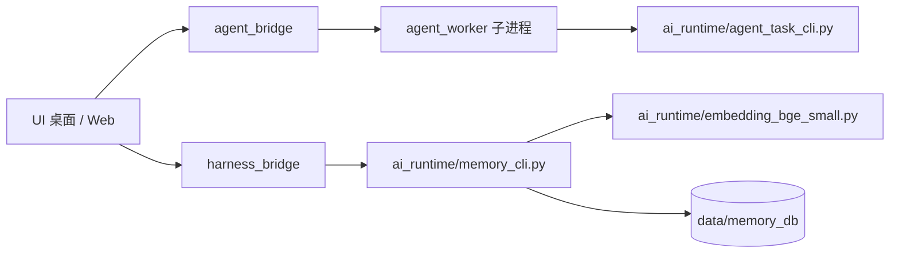

# ai_runtime —— 运行时组件

本目录是 **UI 主流程依赖的本地推理组件**（不是测试脚本，请勿删除）。

| 文件 | 调用方 | 作用 |
|------|--------|------|
| `agent_task_cli.py` | `UI/agent_worker.py`、`UI/agent_bridge.py`（`import agent_task_cli`） | 本地 LLM 会议纪要 / 待办抽取（fiboaisdk + Qwen3-0.6B / DeepSeek-R1-1.5B） |
| `memory_cli.py` | `UI/harness_bridge.py`（子进程调用） | 长期记忆库读写与检索，支持 TF-IDF 与 bge 向量双后端 |
| `embedding_bge_small.py` | `memory_cli.py`（`from embedding_bge_small import FiboBgeSmallEmbedder`） | bge-small-zh-v1.5 文本向量后端（DLC / ONNX） |

## 调用关系



## 手动使用

```bash
cd /home/fibo/MeetingAgent/ai_runtime

# 记忆库写入（常规情况下由 UI 的 harness 自动调用）
python3 -u memory_cli.py add "会议结论文本"
```

## 路径约定

| 项目 | 路径 |
|------|------|
| License | `/home/fibo/qcom_6490_license/`（`key1.pem`、`key2.pem`、`key3.pem`、`license.bin`） |
| 大模型 | `../ai_models/llm_models/`（`Qwen3-0.6B/`、`deepseek-r1-distill-qwen-1.5b/`） |
| 向量模型 | `../ai_models/embedding_models/bge-small-zh-v1.5/` |
| 记忆库数据 | `../data/memory_db/`（`memory.jsonl`、`tfidf_*`、`embedding_*`） |

## 板端 SDK 修复（部署时必做）

安装好的 `fiboaisdk` 里 QNN 后端库只保留了 `.bak` 后缀文件，需补两个软链接，否则 TTS 与 Qwen3 的 QNN 模型初始化会失败：

```bash
ln -s libQnnHtp.so.bak /usr/local/lib/python3.8/dist-packages/fiboaisdk/libQnnHtp.so
ln -s libQnnDsp.so.bak /usr/local/lib/python3.8/dist-packages/fiboaisdk/libQnnDsp.so
```

## 环境校验

```bash
python3 -c "import fiboaisdk; print(fiboaisdk.__file__)"
du -sh /home/fibo/MeetingAgent/ai_models/*
find /home/fibo/MeetingAgent/ai_models -name '*.fmodel' | wc -l
df -h /home
```
